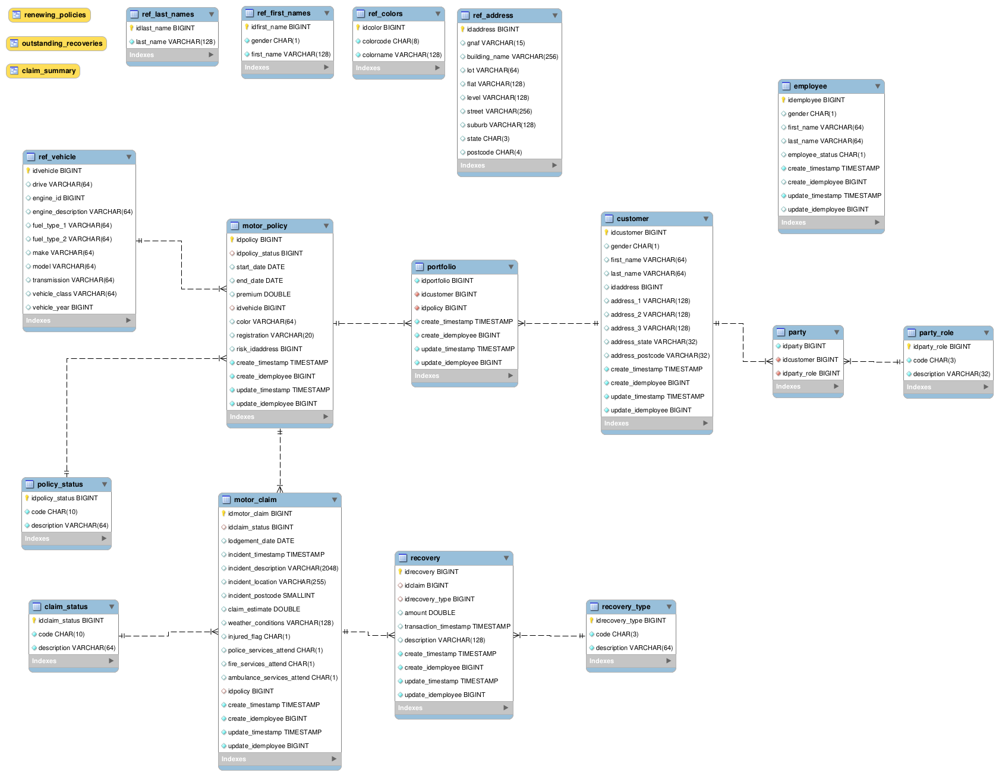

# gen_data_msqly
This application is designed to provide a reusable schema and data for testing the performance and interoperability of systems, databases an/or applications only.

Following the steps below will provide you with a datamodel created in your mySQL database with the means to generate random data.

:exclamation: Refer to [pre-requisites](#user-content-prerequisites) at the bottom of this page 


## About the data
In some cases data may appear to be real.  Data accompanying this application is for developer use only and should not be used for purposes other than intended for this application.
There are no guarentees or claims of accurracy or completeness.

### Colors
  * https://colornames.org/

### Names
  * https://www.census.gov/topics/population/genealogy/data/1990_census/1990_census_namefiles.html

### Vehicles
  * https://fueleconomy.gov/feg/download.shtml

### Address
  * https://data.gov.au/dataset/ds-dga-19432f89-dc3a-4ef3-b943-5326ef1dbecc/details
  * License for this data is via Creative Commons and has been replicated below from the [originating web page](https://data.gov.au/dataset/ds-dga-19432f89-dc3a-4ef3-b943-5326ef1dbecc/details) 
  * Address data has been compiled through the usage of data via PSMA Geocoded National Address File.

## Data Model
* Inspired by a variety of models here at [databaseanswers.org](http://www.databaseanswers.org/data_models/index_all_models.htm)
* The mySQL Wokbench file is also inclued in this repository


## Journeys
### Aquire raw data
Apart from a spreadsheet constaining lookup/dimension/reference type data, all other reference data has is sourced from the internet as documented above.

There is only one step in this journey; run the following script from the 00_rawdata directory to download required reference data.
```bash
   cd 00_rawdata 
   ./getRawData.sh
```

### Preprocessing 
Preprocessing will create a directory for each reference table (excluding status and codes data) to be load and extract and/or format data ready for loading.
Status and Codes coming from the supplied xlsx spreadsheet will be prepared into individual files in the created ref_codes directory; one file per table to be loaded.

Run the 'run all' script to execute all at once or run each shell script individually, however the following journeys are dependant on this step being fully complete.
```bash
   cd 01_preprocessing
   ./runall.sh
```

### ref_codes
* Copy the xlsx to ref_codes
* For each worksheet in the xlsx create a pipe delimted file
* Use the name of the worksheet as the filename
* This is performed by a simple example of using python with Excel files (openpyxl)

### ref_address
* Preparation of the address data makes use of the mysql database.  Regardless of potential double handling; the steps for the address data has been designed to make use of the database to do the preparation.  This is in line with the raw data and IP supplied in the origional download and to the provide consistency of all prepared data and downstream processes. 
* Before performing preprocessing for Address; update the file mysql_config.sh with the path to your mysql.cnf file

* Address may take a while to process, on a medium sized virtual machine it takes ~180minutes
* Warnings may be thrown due to empty dates and other things such as decimal values.  These should be able to be ignored;  verify your ref_address.txt file

* Copy the zip file to ref_address
* Uncompress the zip file 
* Extract the table names and other database objects from the supplied SQL in the zip file
* Some simple parsing of the supplied SQL file is done via python to extract the list of things to be 
* (!) DESTRUCTIVE (!) Check and drop tables and other database objects for the raw address data
* Create tables using the supplied SQL in the zip file
* Loop through the unzipped files and load them to the database
* Create the table and view to facilitate a consolidated 'simple' address table
* Insert select from the supplied view from the zip file
* Export the simplified address table

### ref_colors
* Copy zip file to ref_colors
* Unzip and convert to pipe delimited

### ref_names
* Copy to ref_first_names, last_names
* Make pipe delimited
* concatenate male and female names

### ref_vehicle
* copy to ref_vehicles and unzip


### Loading data
* Preprocessing has already create ref_tablename directories in 01_preprocessing
* (!) Destructive (!) Create the database tables using the sql provided in the datamodel directory
* for each file, load to the corresponding table
* Remove the loaded files and clean up the preprocessing directories.
* On completiong of loading data you should have something like the following:
```------------------------------------------------------------
Looking for tables to run Count
------------------------------------------------------------
  Found 16 tables existing
  Generating Count statements
  Running Count tables
claim_status	COUNT(*)
claim_status	4
customer	COUNT(*)
customer	0
employee	COUNT(*)
employee	0
motor_claim	COUNT(*)
motor_claim	0
motor_policy	COUNT(*)
motor_policy	0
party	COUNT(*)
party	0
party_role	COUNT(*)
party_role	9
policy_status	COUNT(*)
policy_status	4
portfolio	COUNT(*)
portfolio	0
recovery	COUNT(*)
recovery	0
recovery_type	COUNT(*)
recovery_type	2
ref_address	COUNT(*)
ref_address	14827937
ref_colors	COUNT(*)
ref_colors	1470250
ref_first_names	COUNT(*)
ref_first_names	5494
ref_last_names	COUNT(*)
ref_last_names	88799
ref_vehicle	COUNT(*)
ref_vehicle	42275
```

### Generating Transactions data
* from an empty database the following order is required to ensure integrity
1. employee    
1. customer    
1. motor_policy
1. party       
1. portfolio   
1. motor_claim 
1. recovery    

* Defaults for data generatiopn are included in the script 
```bash
cd .. 
cd 03_make_test_data
./make_test_data.sh
```
* Other options including deletes and updates at various frequencies are also available through the following command line options
```
python3 generic_gen.py --help
Usage: generic_gen.py [options]

Options:
  -h, --help            show this help message and exit
  -c MYSQL_OPTION_FILE, --config=MYSQL_OPTION_FILE
                        mysql cnf file
  -n ITERATIONS, --iterations=ITERATIONS
                        Number of iterations to perform
  -k KICKOFF, --kickoff=KICKOFF
                        Starting id to be used, default is max id+1 from the
                        specified table;  Use this for running for the same
                        table in parellel and defined ranges.
  -i DOINSERTS, --insert=DOINSERTS
                        For each iteration perform an Insert
  -u DOUPDATES, --update=DOUPDATES
                        For each iteration AND frequency combination perform
                        an Update on a random record; Note, where large gaps
                        in sequential ID's exist, this may cause many retries
                        to find an existing record.
  -d DODELETES, --delete=DODELETES
                        For each iteration AND frequency combination perform a
                        Delete on a random record; Note, where large gaps in
                        sequential ID's exist, this may cause many retries to
                        find an existing record.
  -a SLEEPAMT, --sleepamt=SLEEPAMT
                        Seconds to sleep between iterations; use this to
                        control the amount of activity/simulate activity on
                        the database table
  -s DBSCHEMA, --schema=DBSCHEMA
                        Database Schema where the table exists
  -t DBTABLE, --table=DBTABLE
                        Database Table name
  -D DELETEFREQ, --deletefreq=DELETEFREQ
                        Delete frequency in iterations; if doDelete = True and
                        current iteration number modulus this value = 0 then a
                        Delete will be performed.
  -U UPDATEFREQ, --updatefreq=UPDATEFREQ
                        Update frequency in iterations; if doUpdate = True and
                        current iteration number modulus this value = 0 then
                        an Update will be performed.

```

* Example 
```bash
python3 generic_gen.py --config=../mysql.cnf --schema=staging --table=employee --iterations=20  --insert=True --update=True --updatefreq=3 --deletefreq=4 --delete=True
```
* On completion of make_test_data.sh you should have the following counts across the loaded tables
```
------------------------------------------------------------
Looking for tables to run Count
------------------------------------------------------------
  Found 16 tables existing
  Generating Count statements
  Running Count tables
claim_status	COUNT(*)
claim_status	4
customer	COUNT(*)
customer	2000
employee	COUNT(*)
employee	20
motor_claim	COUNT(*)
motor_claim	10000
motor_policy	COUNT(*)
motor_policy	20000
party	COUNT(*)
party	0
party_role	COUNT(*)
party_role	9
policy_status	COUNT(*)
policy_status	4
portfolio	COUNT(*)
portfolio	0
recovery	COUNT(*)
recovery	50000
recovery_type	COUNT(*)
recovery_type	2
ref_address	COUNT(*)
ref_address	14827937
ref_colors	COUNT(*)
ref_colors	1470250
ref_first_names	COUNT(*)
ref_first_names	5494
ref_last_names	COUNT(*)
ref_last_names	88799
ref_vehicle	COUNT(*)
ref_vehicle	42275
```

## Prerequisites
1. Create a mySQL database eg.
   ```sql
   CREATE DATABASE test_data;
   CREATE SCHEMA staging;
   ```
1. Create a user with full authority in the database eg.

   ```sql
   CREATE USER jarrod IDENTIFIED BY 'password';
   GRANT ALL PRIVILEGES ON test_data.* TO 'jarrod'@'%';
   ALTER USER jarrod IDENTIFIED WITH mysql_native_password BY 'password';
   ```
1. Update mysql.cnf with your database details eg.
   ```
   [client]
   host=192.168.72.144
   port=3306
   database=staging
   user=jarrod
   password=password
   ```
1. Update mysql_config.sh with the path to your mysql.cnf file eg.
   ```bash
   export pathToOptionsFile=~/projects-gitea/gen_data_mysql/mysql.cnf
   ```